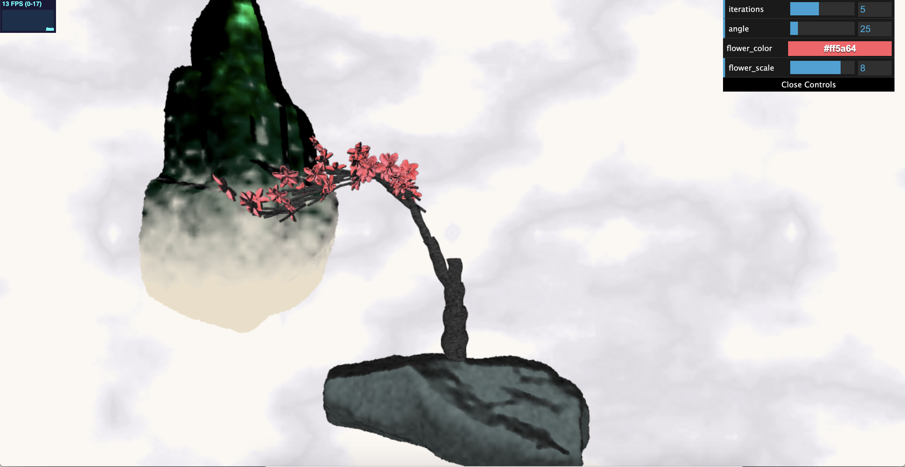
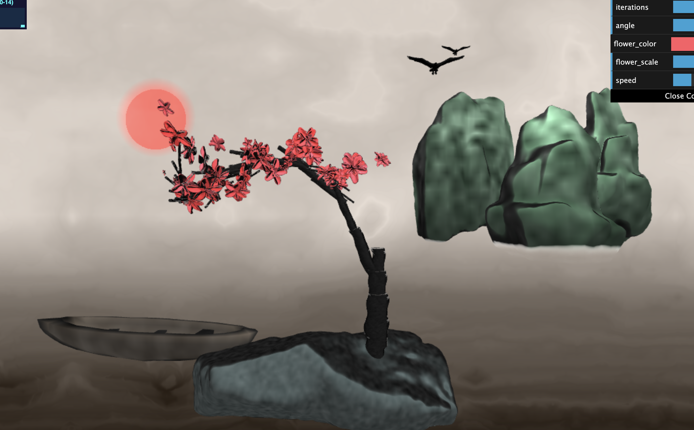

# Final Project!

### Design Doc

#### Introduction

- What motivates our project
  - Interest in real-time stylization in forms of
  - Chinese ink and wash painting
  - Allow users to generate Chinese painting with parameters that control the subject in the project

#### Goal

- What do we intend to achieve with this project
  - Create shaders that produce stylization effects that simulate Chinese ink and wash painting style
  - Allow users to control the appearances of the subjects in the painting, such as the height and range of the mountains, the iterations of the L-systems for the trees, and the number of boats in the river, size of the sun or moon, etc.

#### Inspiration/reference:

- Volumetric : https://www.shadertoy.com/view/4sjfzw
- Hatching: https://www.shadertoy.com/view/MsSGD1
- Sketch drawing: https://www.shadertoy.com/view/ldXfRj
- https://www.shadertoy.com/view/ltyGRV
- https://www.shadertoy.com/view/lt2BRm
- Hatching & pointilism: https://www.cis.upenn.edu/~cis460/17fa/lectures/proceduralColor.pdf
- Video : https://artineering.io/publications/Art-Directed-Watercolor-Stylization-of-3D-Animations-in-Real-Time/
- post-process: https://learnopengl.com/In-Practice/2D-Game/Postprocessing

#### Specification:

- Outline the main features of your project.
  - Water color shader
  - adjustable parameters
  - animation element

#### Techniques:

- main technical/algorithmic tools we'll be using
  - WebGL to display the project
  - Glsl to write shaders
  - Scene:
    - Using instanced rendering to draw the geometries
    - Using lsystem to make the trees
    - Using shape grammar to make the mountains
    - Using noise function to make the fogs
- Ink wash effect:
  - create hand tremors: fluctuations can be simulated by minimally offsetting the vertices from their original positions
  - create pigment turbulence custom watercolor reflectance model extending common shading primitives. Then, pigment turbulence in the form of a low-frequency noise is applied to achieve water effect
  - create color bleeding Apply the gaussian kernel over the bled sections and blend the resulting low-pass image with the color image
  - create edge darkening Build upon the difference of Gaussian feature enhancement algorithms. After that, edges are modulated with smoothstep function to eliminate artifacts
  - reate paper distortion and granulation Directly sample the color values at UVs that have been shifted by the surface inclinations, available through the normal map of the paper texture

#### Design:

The entire project will be written in WebGL: 

#### Timeline:

- Week1 (11/15-11/22):

Amelia: Create project skeleton with instance rendering methods

Effie: Create basic scene

Effie: Code ink wash shader (edge and color bleeding)

Amelia: Code ink wash shader (blur and paper effect)

- Week2 (11/22-11/29): Add elements to the scene like trees, birds, and mountains (each take half of the scene)
- Week3 (11/29-12/6): Tune the scene and add parameters (each take half of the parameters)

## Milestone 2: Implementation part 1 (due 11/22)

Progress:

- set up basic scene and instance rendering
- begin writing shaders for the water color effect

Challenges:

- adding post process shaders are much harder than expected since a sampler2D is needed to passed into the machine.

## Milestone 3: Implementation part 2 (due 11/29)

We're over halfway there! This week should be about fixing bugs and extending the core of your generator. Make sure by the end of this week _your generator works and is feature complete._ Any core engine features that don't make it in this week should be cut! Don't worry if you haven't managed to exactly hit your goals. We're more interested in seeing proof of your development effort than knowing your planned everything perfectly.

Progress:

- added mountain, rocks, and trees
- added shaders for ink wash effects

## Final submission (due 12/6)

Time to polish! Spen this last week of your project using your generator to produce beautiful output. Add textures, tune parameters, play with colors, play with camera animation. Take the feedback from class critques and use it to take your project to the next level.

Submission:

- Push all your code / files to your repository
- Come to class ready to present your finished project
- Update your README with two sections
  - final results with images and a live demo if possible
  - post mortem: how did your project go overall? Did you accomplish your goals? Did you have to pivot?

final result 

post mortem
